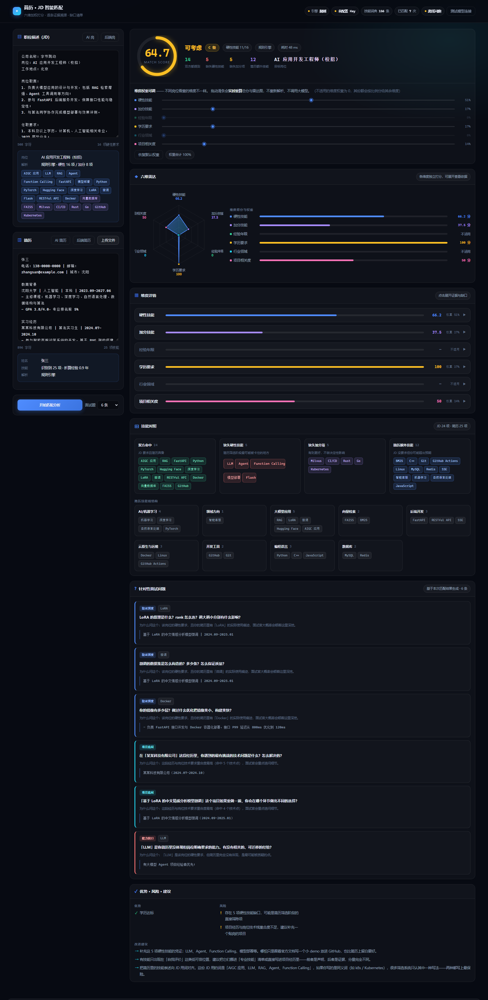
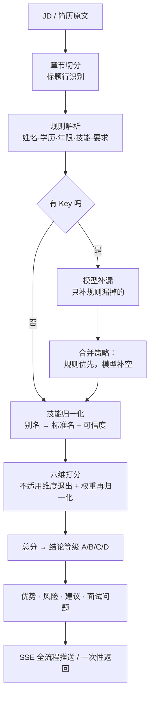

# Resume Matcher · 简历与 JD 智能匹配

> **把一份 JD 和一份简历变成一份可解释的匹配报告**——不是给你一个 82 分，
> 而是告诉你这 82 分是怎么算出来的、哪几条命中了、差在哪里、面试该问什么。

[](https://github.com/zhaosibo-1/resume-matcher/actions/workflows/ci.yml)




---

## 这个项目在做什么

「简历匹配」是 LLM 应用里被做得最烂的一类产品：把两份文本丢给模型，让它直接吐一个分数。
这类实现有三个绕不过去的问题：

| 问题 | 后果 |
| --- | --- |
| **不可复现** | 同一个模型问两遍，得到 78 和 85，用户不知道该信哪个 |
| **不可解释** | 只给「匹配度 82%」，HR 没法核对，候选人没法改进 |
| **不可调权** | 招算法岗和招后端岗用的是同一套权重，模型自己也不知道该看重什么 |

这个项目的做法是**把「理解」和「判断」拆开**：

```
                          ┌─────────────── 模型层（理解）───────────────┐
JD 原文 ──► 规则解析 ──►  │ 只在口语化描述里「补漏」：漏掉的技能、隐含要求  │ ──► 结构化 ParsedJD
                          └──────────────────────────────────────────┘
                          ┌─────────────── 规则层（判断）───────────────┐
简历原文 ─► 规则解析 ──►  │ 技能归一化 ─► 六维加权打分 ─► 证据/差距/面试题  │ ──► MatchReport
                          └──────────────────────────────────────────┘
```

**关键约束：模型从不打分。** 它只负责从「我平时写代码用 Python 比较多」这种句子里
认出 `Python` 这个技能。所有的权重、分段函数、阈值都是代码里的常量，
所以同一份输入永远得到同一个分数——可复现，可解释，可调。

---

## 核心特性

### 1. 拒绝黑盒分数：六维加权 + 逐维证据

总分不是一个数字，而是六个独立维度的加权和，每一维都带 `score` / `detail` / `evidence` / `gaps`：

| 维度 | 默认权重 | 在算什么 |
| --- | --- | --- |
| `must_have` 硬性技能 | 0.35 | JD 里以「必须 / 要求 / 精通」提出的技能，简历覆盖了多少 |
| `nice_to_have` 加分技能 | 0.12 | JD 里以「加分 / 优先 / 了解」提出的技能 |
| `experience` 经验年限 | 0.18 | 简历累计工作/实习年限与 JD 要求年限的差距 |
| `education` 学历要求 | 0.12 | 学历等级是否达标（大专 < 本科 < 硕士 < 博士） |
| `domain` 行业领域 | 0.13 | JD 的行业关键词在简历里的覆盖，判断「做过同类业务」 |
| `project` 项目相关度 | 0.10 | 项目/实习经历与 JD 技能的重合度，以及成果有没有量化数据 |

分数是这样落到界面上的：

```
硬性技能  72.4 / 100   权重 35%   命中 11 / 16
  命中：Python、PyTorch、FastAPI、Docker、RAG、向量数据库(FAISS)…
  缺口：Transformers  ← JD 第 3 条要求「掌握 Transformers 等深度学习框架」
        LoRA 微调      ← JD 第 3 条要求「有 LoRA 微调经验」
        CI/CD          ← JD 第 6 条要求「了解 CI/CD 流程」
  依据：[技能段] Python（精通，出现在「专业技能」章节）
        [实习] 某某科技 算法实习生 2024.07-2024.10（3 个月，命中 RAG/FAISS/FastAPI）
```

### 2. 技能归一化：156 个标准技能 / 487 条别名

简历里同一个东西有无数种写法，不归一化就没法比较：

```python
"JS" / "js" / "JavaScript" / "ECMAScript"   → JavaScript
"k8s" / "K8S" / "Kubernetes"                → Kubernetes
"向量库" / "Vector DB" / "FAISS" / "Milvus" → 向量数据库（FAISS 命中时上位技能一并点亮）
```

更重要的是**技能可信度加权**——同一个技能出现在不同位置，可信度完全不同：

| 出现位置 | 权重 | 理由 |
| --- | --- | --- |
| 专业技能 / 工作经历 | 1.0 | 有上下文，可信度最高 |
| 教育背景 | 0.9 | 课程里出现的技能偏「学过」 |
| 自我评价 | 0.8 | 主观陈述 |
| 其它 | 0.7 | 位置不明确 |
| 求职意向 / 摘要 | 0.55 | 常常是「想学」而不是「会」 |

程度词再做二次微调：`精通 1.0` / `熟练 0.9` / `掌握 0.8` / `熟悉 0.75` / `了解 0.5`。

所以「简历里提到 k8s」不等于「会 k8s」——提到在自我介绍里、还写着「了解」，
和一个「精通 Kubernetes」写了三个项目的人，不该拿一样的分数。

### 3. 强度词四档分层：为什么「熟悉 Kubernetes 者优先」不是硬门槛

这是 JD 解析里最容易错的地方。中文 JD 常把**加分项**写成「熟悉 X 者优先」，
如果只按关键词粗判，会把它当成人人都必须满足的硬性要求，直接把合格候选人判死。

这里把措辞分成四档，按优先级判定：

| 档位 | 措辞 | 判定 |
| --- | --- | --- |
| `STRONG_MUST` | 必须 / 必需 / 要求 / 精通 / 深入 / 扎实 | 硬性要求 |
| `EXPLICIT_NICE` | 加分 / 优先 / 更佳 | **加分项（优先级高于「熟悉」）** |
| `SOFT_MUST` | 熟悉 / 掌握 / 熟练 / 具备 / 负责 | 硬性要求（弱） |
| `GENERAL_NICE` | 有所了解 / 了解 / 有经验 / 锦上添花 | 加分项 |

代码里有一条断言守着这个分层，保证四个常量集合的并集严格等于总标记集合——
**加词的时候不可能漏改一处**：

```python
_TIERED_MUST = STRONG_MUST_WORDS + SOFT_MUST_WORDS
_TIERED_NICE = EXPLICIT_NICE_WORDS + GENERAL_NICE_WORDS
assert set(_TIERED_MUST) == set(MUST_MARKERS)
assert set(_TIERED_NICE) == set(NICE_MARKERS)
```

### 4. 权重再归一化：为什么「信息少的 JD」不该天然低分

有的 JD 不写学历要求，有的不写年限。如果这些维度仍然按 0 分参与计算，
**「要求写得少 = 分数低」**就成了一条荒谬的规律。

正确做法是：不适用的维度**退出**计算，它原来的权重按比例分给剩下的维度。

```
原始：must 0.35 / nice 0.12 / exp 0.18 / edu 0.12 / domain 0.13 / proj 0.10
JD 没写学历要求 → education 退出，权重 0.12 按比例摊给其余五维
结果：must 0.3977 / nice 0.1364 / exp 0.2045 / edu — / domain 0.1477 / proj 0.1136
```

界面上会明确标注「学历要求：不适用（JD 未提及）」，而不是悄悄给个 0 分。

### 5. 拖滑条即时重算：`/api/recompute`

调权重不需要重新调用大模型。前端把已解析的 `ParsedJD` / `ParsedResume` 原样回传，
后端只重算加权和——毫秒级返回。

> 这个接口的存在本身就是那条设计约束的证明：**打分层完全独立于模型层**，
> 所以它可以被单独调用、单独重算、单独测试。

### 6. 零配置可跑（clone 下来就能看）

没有 API Key 也能跑通**全流程**：解析走规则引擎、技能归一化、六维打分、
面试问题生成、前端渲染全都是真实的。所有降级都会在界面上明确标注，不伪装成大模型产出。

这既保证 `git clone` 后开箱可复现，也让 CI 不需要任何 secrets 就能端到端验收。

---

## 快速开始

```bash
git clone https://github.com/zhaosibo-1/resume-matcher.git
cd resume-matcher

python -m venv .venv
source .venv/bin/activate        # Windows: .venv\Scripts\activate
pip install -r requirements.txt

cp .env.example .env             # 不填 Key 也能跑（规则引擎模式）
uvicorn app.main:app --reload
```

打开 <http://127.0.0.1:8000> 即可。首页点「载入示例」会自动填入一份 JD + 一份简历并直接出报告，
无需任何配置。

接真实大模型只需改 `.env`（一套代码兼容所有 OpenAI 协议服务）：

```dotenv
LLM_PRESET=deepseek              # deepseek | qwen | moonshot | zhipu | siliconflow | openai | custom
LLM_API_KEY=sk-your-key-here
# LLM_BASE_URL 和 LLM_MODEL 留空则使用 preset 的默认值
```

Docker 一键起：

```bash
docker compose up -d
```

---

## 项目结构

```
resume-matcher/
├── app/
│   ├── config.py         # 配置 + 7 家厂商预设 + Key 脱敏
│   ├── schemas.py        # 前后端唯一契约（Pydantic）+ 六个维度的定义与默认权重
│   ├── textutil.py       # 文本归一化：全角半角、日期区间解析、中文字数……
│   ├── sections.py       # 简历/ JD 章节切分（标题行识别 + 章节归属）
│   ├── skills.py         # ★ 技能词典（156 技能 / 487 别名）+ 可信度加权 + 强度词分层
│   ├── parser.py         # ★ 规则解析：抽出结构化 ParsedJD / ParsedResume
│   ├── extractor.py      # ★ 三层分工的调度者：规则打底 + 模型补漏 + 自动降级
│   ├── llm.py            # OpenAI 兼容客户端（JSON 提取、错误翻译、重试）
│   ├── matcher.py        # ★ 六维打分 + 权重再归一化 + 证据/差距/面试题/结论
│   └── main.py           # FastAPI + SSE
├── web/index.html        # 深色科技风单页（零构建、零 CDN 依赖）
├── examples/             # 2 份 JD + 2 份简历（校招 / 社招各一套）
├── tests/                # 638 个测试
├── scripts/e2e_check.py  # 黑盒端到端验收（107 项断言）
├── Dockerfile / docker-compose.yml
└── .github/workflows/ci.yml
```

---

## 解析流程



### 模型层的合并策略：补漏，不推翻

这是整个项目里最容易做错、也最值得讲的一个设计点。模型返回的字段和规则层的字段
冲突时，处理方式**逐个字段不同**：

| 字段 | 策略 | 理由 |
| --- | --- | --- |
| `skills` | 规则优先，模型只补规则没有的 | 规则能精确定位技能在文档里的位置（可信度加权依赖位置），模型给的位置不可靠 |
| `name`（姓名） | **模型优先** | 规则只看头部几行，模型能看到「个人简历」这类非常规排版的全文 |
| `school` / `major` | 规则优先 | 规则的正则对中文校名很准 |
| `total_years` | 规则优先，**仅在规则层一条带日期的经历都没有时**才采用模型的 | 规则是从日期区间算出来的，算术比模型的直觉可靠 |
| `bonus_skills` | 只补漏，且**默认按加分项处理** | 加分项的词常常不在原文里（是模型归纳出来的），按行判定会落到默认档而错算成硬门槛 |
| `soft_skills` | 只进 `requirements`，不进 `skills` | 「沟通能力」「团队协作」不是技术技能，不该参与技能覆盖率计算 |
| `seniority` | 白名单校验后采用 | 防止模型自由发挥出「资深专家级」这种不在枚举里的值 |

> 这套「逐字段策略」是踩过坑的产物：早期版本里 `parse_jd` 只消费了模型返回的 `skills`，
> 而 `bonus_skills` / `soft_skills` / `min_years` / `seniority` / `domains` 这些
> **提示词让模型输出、清洗层也认真处理了，但解析层整段丢弃**——
> 典型的三层架构「最后一公里没人接」。测试把这条接缝暴露出来后，才有上面这张策略表。

---

## API

| 方法 | 路径 | 说明 |
| --- | --- | --- |
| `GET` | `/api/health` | 健康检查（含版本、是否启用大模型） |
| `GET` | `/api/config` | 脱敏后的配置（Key 只显示前后各几位） |
| `GET` | `/api/stats` | 累计统计（已存简历数、匹配次数） |
| `GET` | `/api/skills` | 技能词典（支持 `q` 搜索、`limit` 截断） |
| `GET` | `/api/examples` | 内置示例清单 |
| `GET` | `/api/examples/{key}` | 示例详情（JD / 简历原文） |
| `POST` | `/api/resumes` | 上传简历（扩展名白名单 + 文件名清洗 + 大小上限） |
| `GET` | `/api/resumes` | 已上传简历列表 |
| `GET` | `/api/resumes/{id}` | 简历详情 |
| `DELETE` | `/api/resumes/{id}` | 删除简历 |
| `POST` | `/api/parse/jd` | 只解析 JD，看看抽出了什么 |
| `POST` | `/api/parse/resume` | 只解析简历 |
| `POST` | `/api/match` | 一次性匹配，返回完整报告 |
| `POST` | `/api/match/stream` | **SSE 流式匹配**，实时推送各阶段进度 |
| `POST` | `/api/match/batch` | 一个 JD × 多份简历，按分数排序（HR 视角） |
| `POST` | `/api/recompute` | **只重算权重**，不重新解析（拖滑条用） |
| `POST` | `/api/llm/ping` | 大模型连通性自检 |

交互式文档：<http://127.0.0.1:8000/docs>

### SSE 事件一览

| 事件 | 载荷要点 |
| --- | --- |
| `start` | 请求开始（引擎模式、是否启用大模型） |
| `stage` | 当前阶段（`jd` / `resume` / `score`）+ 进度百分比 |
| `parsed` | 某一边解析完成（关键字段摘要） |
| `scored` | 打分完成（含六维分数） |
| `done` | 完整报告（`MatchResponse` 的 JSON） |
| `error` | 出错（附带可读的原因） |

最后一定会补一条 `event: [DONE]`，前端据此收尾。

---

## 配置项

| 变量 | 默认 | 说明 |
| --- | --- | --- |
| `LLM_PRESET` | `deepseek` | 厂商预设，决定默认 `base_url` / `model` |
| `LLM_API_KEY` | 空 | 留空即走规则引擎模式 |
| `LLM_TEMPERATURE` | `0.0` | 抽取任务要稳定可复现，默认压到 0 |
| `PARSER_ENGINE` | `auto` | `auto` / `rule` / `llm` |
| `MAX_UPLOAD_MB` | `5` | 简历上传大小上限 |
| `DATA_DIR` | `data` | 简历落盘目录（**不要提交到仓库**） |
| `CLAMP_WEIGHTS` | `true` | 权重归一化后是否夹取到合法区间 |
| `STORE_PERSIST` | `true` | 上传的简历是否写盘（测试环境设 `false`） |
| `CORS_ORIGINS` | `*` | 生产环境务必收窄 |

---

## 测试

```bash
pip install -r requirements-dev.txt
pytest -v
```

**638 个测试，全程不需要任何 API Key。**

| 文件 | 数量 | 覆盖内容 |
| --- | --- | --- |
| `test_textutil.py` | 69 | 全角半角、日期区间解析、月数计算、中文字数 |
| `test_sections.py` | 47 | 章节标题识别、章节归属、非常规排版 |
| `test_skills.py` | 67 | 别名归一化、可信度加权、上位技能继承、强度词分层 |
| `test_parser.py` | 112 | 姓名/学校/学历/年限/技能/要求的抽取，含各种否定与歧义句式 |
| `test_config.py` | 39 | 密钥脱敏、零配置可跑、环境变量解析与夹取 |
| `test_llm.py` | 41 | JSON 提取三种策略、括号平衡扫描、HTTP 错误分类与重试 |
| `test_store.py` | 37 | id 合法性前置校验（防路径穿越）、损坏文件容错、编码落盘 |
| `test_extractor.py` | 44 | 三模式路由、各类降级、抽取 → 解析接缝 |
| `test_matcher.py` | 93 | 可信度加权、权重再归一化、分段折线、可复现性、区分度 |
| `test_api.py` | 66 | HTTP 契约、SSE 事件序列、批量、重算、上传边界 |
| `test_frontend_contract.py` | 23 | **静态扫前端源码，和真实接口返回做字段差集** |

### 前端契约测试在防什么

写前端最容易出的 bug 不是报错，而是**静默渲染 `undefined`**：后端改了字段名，
前端还在读老名字，界面上那个位置就变成空白——不报错、不崩溃，只是悄悄错了。

`test_frontend_contract.py` 会把 `web/index.html` 里所有 `var.field` 形式的字段访问
静态扫出来，核对每一个是否属于对应接口的 pydantic 模型；同时检查 JS 里
`$("id")` 引用的元素在 HTML 里确实存在、雷达图颜色表覆盖了全部六个维度。

### 黑盒端到端验收

除了单测，还有一份会对**真实运行的服务**打 107 项断言的验收脚本（CI 里也会跑）。
它只依赖标准库，专门抓那些「单测全绿但服务起不来」的问题——缺依赖、静态文件路径错、
lifespan 装配顺序错：

```bash
uvicorn app.main:app --port 8111 &
python scripts/e2e_check.py http://127.0.0.1:8111
```

---

## 设计取舍

**为什么不让模型直接打分？**
因为分数一旦由模型生成，就同时失去了三样东西：可复现（同输入不同输出）、
可解释（说不清 82 分怎么来的）、可调权（改不了模型的偏好）。
现在的做法是模型只做**信息抽取**（它擅长且相对稳定），判断交给代码（确定且可测）。

**为什么宁可写 156 条技能词典，也不让模型自由识别技能？**
规则识别能精确给出**技能在文档里的位置**，而位置直接决定可信度权重。
模型只能给出「简历里有 k8s」这个结论，给不出「出现在第 4 行自我评价里」这种定位。
另外词典是可控的：加一个别名，所有历史结果的行为都变得可预期。

**为什么降级要「明确告知」而不是静默兜底？**
静默降级是最危险的一类工程决策：用户以为看到的是大模型的判断，
实际是规则引擎的结果，而两者在边界情况上的差异可能很大。
本项目所有降级都会写进 `/api/config` 的 `engine` 字段并在界面上标注出来。

**为什么所有维度都不适用时要额外插一条风险提示？**
因为「0 分」会被读成「你完全不匹配」，而真实情况往往是**文本太短或格式太乱，
解析器根本没抽出东西**。这时最重要的不是给分，而是告诉用户「这个分数不可信」：

> 当前分数不代表真实匹配度，请检查文本是否完整、格式是否规整。

---

## 安全说明

- `.env` 已在 `.gitignore` 中，仓库里只有 `.env.example` 的**占位符**；
- `data/`（上传的简历，属于用户隐私）同时被 `.gitignore` 与 `.dockerignore` 排除，
  不会进仓库、也不会被打进镜像层；
- 简历 id 在读写前做**合法性前置校验**，从入口挡掉路径穿越；
- `/api/config` 返回的 Key 一律脱敏，短 Key 直接显示为 `****`；
- 上传接口对扩展名做白名单、对文件名做清洗、对大小做上限；
- 容器以非 root 用户（uid 10001）运行。

## License

[MIT](LICENSE) © 2026 赵思博
